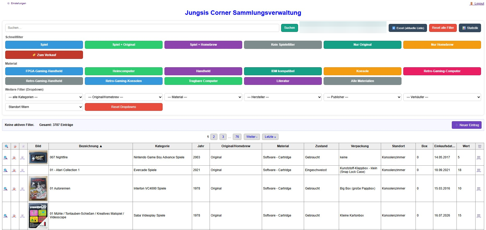
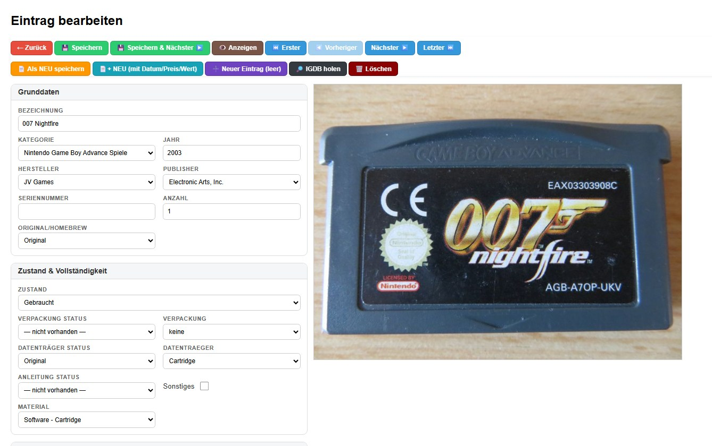
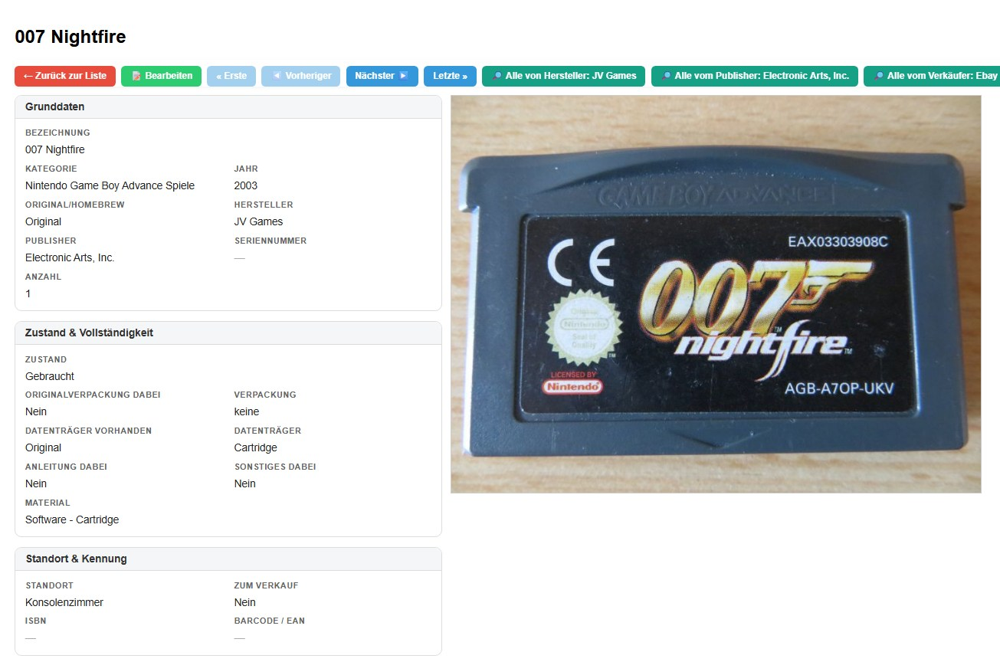
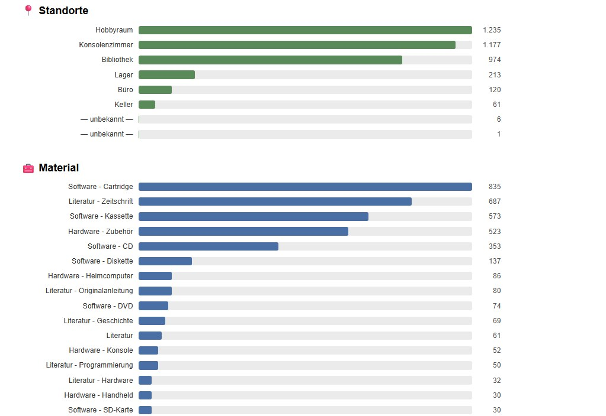

# Sammlungsdatenbank

Eine selbstgebaute Web-Anwendung (PHP/MySQL) zur Verwaltung einer physischen Sammlung – ursprünglich für eine Retro-Computing-/Gaming-Sammlung mit über 1.300 Objekten entwickelt (Heimcomputer, Konsolen, Handhelds, Spiele, Zubehör, Literatur).

📖 Hintergrund & Entwicklungs-Changelog: [jungsi.de/datenbank-changelog](https://www.jungsi.de/datenbank-changelog/)

## Screenshots

| Listenansicht | Bearbeiten |
|---|---|
|  |  |

| Detailansicht | Statistik |
|---|---|
|  |  |

<!-- Bilder einfach als index.png / edit.png / view.png / statistik.png in docs/screenshots/ ablegen, dann werden sie hier automatisch angezeigt. -->

## Was kann die App?

- Vollständige CRUD-Verwaltung von Sammlungsobjekten (Bezeichnung, Kategorie, Hersteller, Zustand, Vollständigkeit, Standort, Kaufdaten, Testdaten, uvm.)
- Trennung von **Erhaltungszustand** und **Vollständigkeit** (Original/Nachdruck je Komponente: Verpackung, Anleitung, Datenträger)
- Verknüpfung zusammengehöriger Objekte (z. B. eingebautes Zubehör oder separat gelagerte Handbücher) über „Gehört zu"
- Automatischer Import von Spielbeschreibungen über die [IGDB-API](https://api-docs.igdb.com/) inkl. optionaler automatischer Übersetzung (DeepL)
- Barcode-Scan per Kamera (Handy/Tablet) zur schnellen Erfassung
- Einkaufslisten-Verwaltung (`einkauf.php`) mit Direktübernahme in die Sammlung
- Gast-Modus (Nur-Lese-Ansicht ohne sensible Felder wie Wert/Einkaufspreis)
- CSV-Export der aktuell gefilterten/sortierten Liste
- Statistik-Seite mit Verteilungen nach Standort, Material, Kategorie, Einkaufsjahr etc.
- **Museum-Modus** (`museum/index.php`): Ein Kurzlink, der Besucher automatisch als Gast einloggt und direkt zur Sammlung weiterleitet – gedacht für den Vor-Ort-Einsatz, z. B. per QR-Code an einem Regal oder einer Vitrine (siehe auch `go.php` für numerische Kurzcodes zu gefilterten Ansichten). Kein Passwort nötig, da nur Lesezugriff.
- **Verkaufsmarkierung**: Duplikate/Mehrfachexemplare lassen sich als „Zum Verkauf“ kennzeichnen, inkl. Schnellfilter in der Listenansicht.
- **Admin-Log-Viewer** (`logview.php`): Die letzten Zeilen des PHP-Error-Logs direkt im Browser einsehen, ohne FTP-Zugriff – mit einfacher Passwort-/Token-Maskierung.

## ⚠️ Wichtig, bevor du startest

Dieses Projekt ist **aus einem konkreten, persönlichen Anwendungsfall gewachsen** – nicht als generisches, sofort einsatzbereites Produkt geplant. Konkret bedeutet das:

- Feldnamen und Oberfläche sind **auf Deutsch** und an eine Retro-Computing-Sammlung angepasst (z. B. „Datenträger", „Verpackung", „Original/Homebrew"). Für andere Sammelgebiete musst du Felder/Kategorien anpassen.
- Getestet auf klassischem Shared-Hosting (Apache + PHP + MySQL). Für andere Umgebungen (nginx, Docker, …) sind ggf. Anpassungen an `.htaccess` nötig.
- Die PWA-Konfiguration (`manifest.json`, `sw.js`) enthält fest eincodierte Pfade (`/sammlung/…`), die beim Fork an den eigenen Installationsort angepasst werden müssen.
- Es gibt (noch) keine automatisierten Tests.

Betrachte es als **Vorlage zum Forken und Anpassen**, nicht als fertiges Produkt zum 1:1-Deployen.

## 🔒 Sicherheitshinweise

- **Admin-Passwort sofort selbst setzen** – den Hash in `config.php` niemals aus einer Anleitung/einem Beispiel übernehmen, siehe Setup-Schritt 2.
- `config.php` niemals committen (ist per `.gitignore` bereits ausgeschlossen) – sie enthält Datenbank-Zugangsdaten, API-Keys und den Admin-Passwort-Hash.
- Bevor du eigene Debug-/Testskripte im Projektordner ablegst (z. B. um mal eben eine API oder einen Datenbank-Query auszuprobieren): entweder mit `is_admin()` absichern wie `logview.php`, oder nach Gebrauch konsequent wieder löschen. Unauthentifizierte Skripte mit Datenbankzugriff oder fest eincodierten Zugangsdaten sind ein leicht vermeidbares, aber ernstes Risiko.
- Bei Secrets, die versehentlich committet wurden: nicht nur die Datei löschen, sondern das jeweilige Secret beim Anbieter widerrufen/neu generieren (der alte Wert bleibt sonst in der Git-Historie sichtbar) und bei Bedarf die Git-Historie bereinigen.

## Setup

1. Repository klonen:
   ```
   git clone https://github.com/DEIN-NAME/sammlungsdatenbank.git
   ```
2. `config.example.php` zu `config.php` kopieren, eigene Datenbank-Zugangsdaten eintragen und ein Admin-Passwort per `php -r "echo password_hash('DEIN-PASSWORT', PASSWORD_DEFAULT);"` erzeugen (Ergebnis in `ADMIN_PASSWORD_HASH` eintragen).
3. Datenbankschema importieren (`schema.sql`, z. B. über phpMyAdmin → Importieren).
4. Auf einem PHP-fähigen Webserver bereitstellen (getestet mit PHP 8.x + MySQL/MariaDB).

## Voraussetzungen

- PHP 8.0+
- MySQL oder MariaDB
- Apache mit `mod_rewrite` (für `.htaccess`)
- Optional: kostenloser [Twitch-Developer-Account](https://dev.twitch.tv/console/apps) für IGDB-Import, [DeepL-API-Key](https://www.deepl.com/de/pro-api) für automatische Übersetzung

## Lizenz

MIT – siehe [LICENSE](LICENSE). Nutzung, Anpassung und Weiterverbreitung ausdrücklich erwünscht.

## Danksagung

Ein Großteil der Weiterentwicklung entstand mit Unterstützung von [Claude](https://claude.com) (Anthropic).
